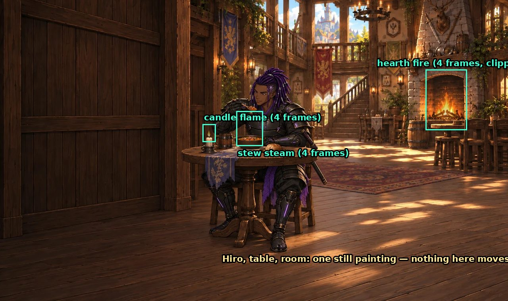
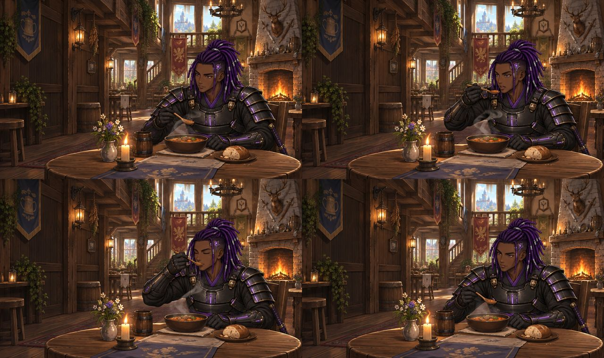
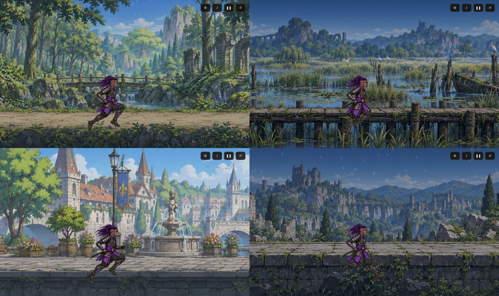

# Adventurer: Expeditions — Art Standard

Version 1.1 · September 24, 2026 · Research and standard only; nothing in the
game has changed. 1.1 adds the version 1 monster roster, the two-finisher rule
and the defeat effect per location (§7). Direction: Hiro. Painting: Astra (Codex, OpenAI image generation).
Briefs, intake, runtime and this document: Fable (Claude).

This is the standard every new piece of art for Expeditions is made to. It
starts from two verified facts — how the inn is built and how travel is built —
and sets the rule that follows from them: **because Hiro is the only playable
character, every scene the player does not control is painted with Hiro in it.**

Evidence images sit beside this file in `docs/art_research/`.

---

## 1. Why this exists

Hiro, 2026-09-24:

> I like how the inn scene looks with him sitting at the table, mid pose about
> to eat a steaming stew … it looks so polished because Astra drew him into the
> scene … it still looks better than the animated travel scene, because Hiro
> doesn't look like he truly fits into the background, does not line up with
> the roads, background image does not seem to take into consideration of him
> being there.

> We can take advantage of the fact that it will only be Hiro and draw him into
> the scenes that are not interactive, for example inn scene and travel scenes.

Version 1 has one hero (GDD §2, 2026-09-22). A game with one hero can afford
what a party game cannot: scenery painted around that hero, pose by pose.

---

## 2. The standard

1. **Non-interactive scenes are paintings with Hiro inside them.** The inn and
   every travel beat. The painting is composed around his pose: his feet sit on
   the painted ground, the light on him is the scene's light, and the scenery
   reacts to him (grass parts, a branch he ducks, a carriage he vaults).
2. **Interactive scenes keep separate sprites.** Fights must react to play —
   who attacks, who is hit, who is finished — so Hiro and the monsters stay
   separate animated sprites over a battle plate. This standard does not change
   combat art.
3. **Motion is painted keyframes plus small loops, never rigs.** Carried over
   from GDD §10: full painted frames played as limited animation (holds, smears,
   ease), environmental loops for fire, steam, water, grass and cloth. No
   cutouts, puppets or part rigs.
4. **One generator family.** All shipped art so far is OpenAI image generation
   through Astra's Codex session (every file carries OpenAI's C2PA content
   signature). New art stays with that family so the look does not drift.
5. **Every painting has a clean plate and a manifest.** Anything that animates
   on top of a painting needs the painting without it, plus exact positions and
   timings (§6). The inn's `inn.json` is the model.
6. **Enemies are monsters only** (Hiro, 2026-09-24). See §7.
7. **Every enemy gets at least two unique Hiro finishing moves** (Hiro,
   2026-09-24). Unique to that monster, painted with Hiro and that monster
   together on one sheet. A monster is not ready to fight until both exist.
8. **Each location has its own defeat effect** — sparkle in the forest, mud in
   the swamp, blue flame in the city (§7.3).
9. **Existing rules still bind:** no placeholder art in the shipped game;
   greenlight per clip after it is seen in the game; masters stay out of the
   deploy folder; every delivery keeps its prompt and reference records.

---

## 3. How the inn is built — verified 2026-09-24

- **One still painting is the whole scene.** `assets/expedition/inn/inn-hiro-solo.webp`,
  1280 × 760: room, table, stew, seated Hiro with the spoon raised. Hiro is not
  a sprite. `js/expedition/inn_art.js`: *"seated characters are part of the
  painting … no duplicate standing actors."*
- **Three small loops animate on top**, each a 4-frame strip on transparent
  background placed at exact coordinates from `inn.json`:

| Loop | Frames | Round trip | Opacity | Note |
|---|---|---|---|---|
| Candle flame | 4 | ~0.86 s | 80 % | The painted candle was left unlit on purpose |
| Stew steam | 4 | ~2.4 s | 16 % | The painted stew has no steam on purpose |
| Hearth fire | 4, calm order 0-2-3-2 | ~0.78 s | 50 % | Clipped to the fireplace opening |

- `inn_art.js` picks each loop's frame from its per-frame timings every screen
  update, and pauses with the game.
- **Hiro himself does not move.** Astra tried a four-painting eating loop; it
  was rejected (`doNotShip`) because the four paintings did not line up with
  each other and left no room for the menus.

**Lesson for travel:** the inn works because the moving parts are *small and
registered to one painting*. It failed exactly where whole paintings had to
match each other frame to frame.

**Inn decision (Hiro, 2026-09-24):** the inn stays as it is. The painting with
Bram at the table is shown **at random, now and then**, when the player returns
from a quest — "it will add mystery." Today the code shows it only when Bram is
hired, which never happens in version 1, so this needs a small code change
(`Art.variant` in `inn_art.js`) and a chosen frequency. It also keeps
`inn-hiro-bram.webp` (0.16 MB) in the package, reversing the size review's idea
of dropping it. Not built.

---

## 4. How travel is built — verified 2026-09-24

*The four travel scenes as the game draws them: Road in the Rain (forest), the
reed marsh, the city watch, the old ruins.*

- **Background: one wide panorama, scrolled sideways.** `assets/anime/travel/v1/runtime/`
  — forest, marsh and ruins at 1452 × 510, city at 2053 × 360 — scaled to the
  screen height and repeated as a scrolling strip (`js/ui/travel_panorama.js`,
  shared code). These panoramas were made for the Adventurer website, before
  Expeditions and before this Hiro existed.
- **Movement on the background is done in code, not painted.** The website's
  ambience system (`js/ui/travel_ambience.js`) shimmers water regions, sways
  foliage strips, drifts leaves, mist and birds, and flutters city banners. The
  game adds weather, a time-of-day tint, and small dust puffs drawn by code.
- **Hiro is a separate sprite running in place.** His 16-frame samurai run
  (`walk` clip, 50 ms a frame, 0.8 s a cycle) plays at a fixed spot — x 560, feet
  at y 690, 300 px tall — while the panorama slides behind him at 192 px a
  second.

**Why it does not fit — measured, not just felt:**

1. **Nothing was painted for him.** His feet sit at one fixed height on every
   location. In the city and the ruins that height is the face of a wall, below
   the walkway; in the marsh his legs cross the boardwalk posts.
2. **His feet slide.** The run cycle plants a foot twice per 0.8 s, but the
   ground moves only ~77 px per step — far shorter than the stride his legs
   show at 300 px tall. The eye reads that as skating.
3. **Different light and finish.** The panoramas are the website's brighter,
   flatter storybook style; Hiro is rendered like the inn painting. He has no
   contact shadow and nothing in the scene touches him.
4. **Nothing reacts to him.** Grass sways on a timer, not at his feet; there is
   nothing to duck, vault or climb.

**Timing today.** With no companions, a travel beat is short: outbound and
return about 3.4 s, between fights about 2.2 s. New painted beats must either
fit those lengths or the lengths change on purpose.

---

## 5. The new travel standard — painted run-through scenes

**Goal (Hiro):** Hiro running *through* a scene painted with him in it — grass
swaying at the touch of his feet, dodging tree limbs, sliding under a fallen log,
vaulting a broken-down carriage, weaving through a merchant crowd, vaulting a
stall, climbing a building and running its rooftops.

### 5.1 How to build it — three options

**A. Whole-scene painted sequence.** Every frame is a full painting of the scene
with Hiro in it, like the rejected inn storyboard. *Most beautiful per frame;
highest risk* — this is the exact method that failed at the inn, because the
scenery and Hiro drift between paintings. Not recommended.

**B. Painted plate + Hiro painted onto that plate + local loops (recommended).**
The inn method, extended to motion:

1. **Key painting** — one finished painting of the whole beat with Hiro in it,
   the target look (like the inn's single still). Greenlit first.
2. **Clean plate** — the same painting without Hiro, wider than the screen so
   the camera can pan across it.
3. **Hiro's action frames painted against that plate** — the vault, the slide,
   the climb — on the plate's own ground line, perspective and light, with
   contact shadows. This is the same trick that already works for the paired
   finishers, where Hiro and the wolf are painted together on one sheet so they
   line up.
4. **Local loops where he touches the world** — grass parting, dust, splashes,
   a swinging branch, a flinching merchant — small strips placed at his
   footfalls, timed to his foot-contact frames (the run clip already records
   them: frames 0 and 8).
5. **A camera path** — the view pans with him across the plate at the speed his
   stride implies, so his feet stop sliding.

Why B: every moving part is small and registered to one painting — the property
that made the inn work — while the scene is still painted around him.

**C. Image-to-video.** Generate a short clip from the key painting and extract
frames (GDD v0.5 "upgrade path"). Smoothest motion if the tool exists, but
Astra's current tool is still images; video frames are heavy; and style control
is weaker. Park until a tool is available and tested.

### 5.2 Beats per location

| Location (level) | Beats Hiro named | Status |
|---|---|---|
| Forest road — Road in the Rain | grass that sways around him as he runs; ducking tree limbs; vaulting a broken-down carriage | proposed |
| Swamp — the reed marsh | sliding under a fallen log | proposed; more beats open |
| City | weaving through crowds of merchants; vaulting a merchant stand; climbing a building; running its rooftops | proposed |

Version 1 has **three** locations — forest, swamp, city — and ends after the
city (GDD §5, 2026-09-24). The old ruins is out of version 1, so it needs no
travel beats.

Which travel leg (outbound, between fights, return) plays which beat is open.

### 5.3 Size

Travel art loads after the first fight starts, so under CrazyGames' rule it does
not count toward the 20 MB initial download (GDD §12a.0). Rough cost per beat:
one plate (0.3–0.6 MB, like today's panoramas) plus 8–16 Hiro action frames and
a few loops — on the order of 1–2 MB. To be measured on the first delivery.

---

## 6. What Astra delivers per travel beat

The handoff contract (GDD v0.5 §5.3) applied to a painted travel beat.

**Fable writes the brief:** beat ID; screen size 1280 × 760 and plate size;
references to feed (Hiro turnaround, the final inn painting as the finish
target, Hiro's current run sheet, the location's battle plates for continuity);
the key pose; the frame list with one line per pose; the ground path; facing;
light direction; what must not change between frames (scale, locs, blade,
light); where the travel dialogue box and corner buttons sit, so they stay clear.

**Astra returns:**

1. Key painting with Hiro (for greenlight before anything else).
2. Clean plate, wider than the screen, same camera and light.
3. Hiro action sheet(s) painted against the plate — flat or transparent
   background as the brief says, full body, nothing cropped.
4. Loop strips (grass, dust, water, crowd), 4 frames each, transparent.
5. A manifest in the shape of `inn.json`: plate size; Hiro's position and
   scale per frame; foot-contact frames; the camera path; loop placements and
   timings; clip rectangles.
6. Prompt and reference records, as today.

**Fable then** keys, trims, registers and packs; builds the travel player;
checks it in the game at full size and phone size; Hiro greenlights clip by clip.

**First test before committing:** one beat only — the forest road carriage
vault. It proves the method, the registration, the camera speed and the size
before any other location is painted.

---

## 7. Enemies — monsters only

Hiro, 2026-09-24: every enemy Hiro fights is a monster. More monsters will be
made to fit each location alongside the wolf and the thorn plant. This keeps
the dismemberment and disintegration finishes **off human characters**.

**Rating.** PEGI 12 allows "more detailed and realistic-looking violence towards
fantasy characters", while violence toward humans at 12 must show no blood or
injuries. Monsters-only keeps the finishes inside PEGI 12. One caution:
CrazyGames lists **content targeted at kids** as a rejection cause, so the target
stays PEGI 12 (GDD §14) — suitable for younger players, not styled as a
children's game.

Each new monster follows the existing enemy art pipeline: an animated set plus
Hiro's paired finishers against it, painted together, before it is fielded.

### 7.1 The version 1 roster (Hiro, 2026-09-24)

Every design, skill set and roar comes from the original Adventurer game: the
creature paintings on `creatures_1`–`creatures_7`, the stat blocks in
`js/data/enemies.js` and `js/data/minibosses.js`, and two recorded roars per
creature in `../adventurer/audio/vo/campaign/<id>/`. That is how the wolf and
the thorn plant were set up. Sound effects use the existing families in
`audio/sfx/`.

| Location | Monster | Role | Original data | Signature skill |
|---|---|---|---|---|
| **Forest** (Road in the Rain) | Dire wolf | regular | `dire_wolf` | Pack Snap — tearing bite, stacking bleed |
| | Thorn plant | regular | `thorn_lurker` | Thorn Lash — roots and poisons |
| | Alpha | **boss** | `alpha` | Pack Snap, Cleave |
| **Swamp** (reed marsh) | Serpent | regular | `river_serpent` | Coil Crush — wraps the prey: root and a stolen action |
| | Beetle | regular | `iron_beetle` | Carapace Burst — detonates its shell: shock, thorns on itself |
| | Moss giant | regular | `moss_giant` | Treefall — drops the canopy, delays everyone it hits |
| | Hag | **boss** | `mire_hag` | Bog Curse — wither and poison |
| **City** | Goblin | regular | `goblin_king` (a plain goblin is made from it) | Backstab, Smoke Bomb |
| | Spider | regular | `crystal_spider` | Glass Web — root and frost |
| | Orc | **boss** | `orc_king` | War Bellow, Cleave, Sunder |

In the original game the swamp and city creatures are all mini-bosses, so the
regular versions get lower stats here, the way `dire_wolf_2` is tuned today.
Only the goblin has no ordinary version in the original data.

The forest's three are already painted, in the game and finishable. Everything
in the swamp and city is new art.

### 7.2 At least two unique finishing moves per enemy

**Rule (Hiro, 2026-09-24): every enemy has at least two finishing moves that
are unique to it.** Each is a paired sheet with Hiro and that monster painted
together, with contact and release frames marked, like the existing pairs. A
generic pair must never be attached to a different monster (Astra's handoff
rule of 2026-09-21).

- **Forest — already met in the delivered art.** Astra's source files hold
  three pairs each: wolf (cleave, pin, rising cut), plant (stem cut, cross cut,
  vine pin), Alpha (cleave, parry, pin). Check at intake that at least two of
  each are in the game.
- **Swamp and city — 7 new monsters × at least 2 = at least 14 new paired
  sheets.** Each finish should use what makes that monster distinct: cutting
  through the serpent's coil, cracking the beetle's shell, felling the moss
  giant like a tree, breaking the hag's staff; slipping the goblin's backstab,
  cutting the spider's web, disarming the orc's axe.
- Finishers show dismemberment and disintegration on monsters, never on humans.
  Every creature on the roster is a fantasy character; the goblin, orc and hag
  are humanoid, which the location defeat effects below keep stylized.

### 7.3 Defeat effects by location

A defeated monster leaves the fight by its location's effect, after the last
frame of its finisher or its down clip.

| Location | Defeat effect | Status |
|---|---|---|
| Forest | Sparkling defeat light (today's effect) | built |
| Swamp | **Melts away into mud**: the body sags and slumps into a bubbling mud pool that sinks into the ground | new |
| City | **Burns away in magical blue flames**: blue fire sweeps across the body, leaving drifting blue embers | new |

**How to build them — recommended: one shared effect per location plus a
dissolve done in code.** Astra paints each effect once as transparent loops;
Fable plays it over any monster and dissolves the body with a moving mask.
Painting a melt or burn for every monster would multiply the art by the roster.

- **Swamp, Astra paints:** a mud splash burst (4–6 frames), a bubbling mud pool
  loop (4 frames), and dripping-mud overlay strips. **Fable:** a top-down
  dissolve that browns the body as it sinks, with the pool left for a moment.
- **City, Astra paints:** a blue flame sheet rising (4–6 frames), a blue fire
  burst, and blue ember and ash motes. **Fable:** a burn-edge dissolve with a
  blue glow on the edge, embers drifting up after.

Both effects apply to the bosses too.

---

## 8. Open decisions for Hiro

1. How often the Bram inn painting appears on return (§3).
2. Which travel leg plays which beat (§5.2).
3. Approve option B and the one-beat test (carriage vault) as the first job for
   Astra when art resumes (§6).
4. Whether travel beats may run longer than today's ~2–3.4 s.
5. Approve the shared-effect-plus-dissolve method for the mud and blue-flame
   defeats (§7.3).
6. Whether the orc also appears as a regular in the city's waves or only as the
   boss (§7.1 reads it as boss only).
7. **Arcade UI (2026-09-28).** The score pill's ★ and the End scene's plain
   dark panel are placeholders. When art resumes: a small painted score mark
   in the game's gold, and a background for the End scene (the inn at night,
   or the road at dawn) in the same method as §3. The high-score frame, rank
   medals and the tutorial glove are drawn in code (2026-09-27) and need no
   bitmap; keep them unless a painted set is clearly better and still small.

---

## Sources

- `js/expedition/inn_art.js`, `assets/expedition/inn/inn.json` — inn build.
- `../adventurer-expeditions-source-art/astra-v2/backgrounds/inn-review.md`,
  `inn-prompts.md` — Astra's inn delivery and the rejected storyboard.
- `js/expedition/scenes_town.js` (TravelScene), `js/ui/travel_panorama.js`,
  `js/ui/travel_ambience.js`, `assets/expedition/hiro/hiro.json` (walk clip) —
  travel build.
- Screenshots: captured from the running game, 2026-09-24.
- Monster roster: `js/data/enemies.js`, `js/data/minibosses.js`,
  `js/data/monster_skills.js`; designs `../adventurer/assets/anime/v2/runtime/creatures_1`–`7.webp`;
  roars `../adventurer/audio/vo/campaign/`; existing pairs
  `../adventurer-expeditions-source-art/astra-v2/heroes/hiro/` and `beasts/alpha/`.
- PEGI descriptions: <https://askaboutgames.com/need-to-know/pegi-ratings>.
- CrazyGames requirements: GDD §12a.0, §14.
